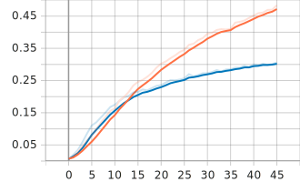
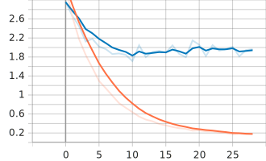
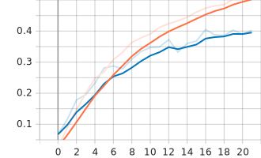
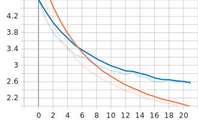
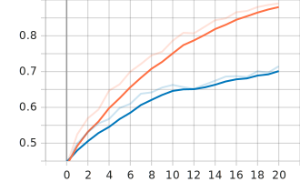

# Report: Sprint Project 05
> Vehicle classification from images

## 1. The task
The main goal in this project was to build a CNN model capable of predicting car classes appearing in a set of images. As a base model, imagenet weights are used within the structure of a ResNet50 neural network. As a first approach, the parameters obtained by the images selected for the training are positioned in the top layer of the network. Then, having some custom weights as a result, a round of fine tuning is performed in the whole structure unfreezing the layers previously set to non-trainable. At this point, an improvement in the accuracy metrics is expected, but given the images dataset present considerable backgrounds that would feed noise into the training, a removal background step is then applied to the whole dataset, in order to perform another training session from with the cropped images, in order to achieve better validation accuracy scores.

## 2. The data
Data is composed of 196 classes of cars, totaling 16185 images, where 8144 were used for training and 8041 for the test set. In the training step, the samples were split in train and validation, using the 20% for the last one. Cars appear in multiple positions and angles. Data augmentation such as random zoom, height and width is also applied in the model.

## 3. The workflow
Images are downloaded from an S3 bucket using the 'download.py' script. Then, with 'prepare_train_dataset.py' the folders for each class of car are created, inside the separation between train and test folders. All the files are reorganized through this new directories. The 'resnet_50.py' parameters are called from the 'train.py' script, that also obtains parameters for the model from the 'config.yml' file that is loaded in 'utils.py'. Data augmentation step uses the configuration specified in the .yml file and the layers are created in 'data_aug.py' and sent to the model file. For the second part of the training, dataset are processed with the 'remove_background.py' script, that thanks to Detectron2 technology inside 'detection.py' removes everything but the frame of the car in every image.

A docker image is mounted in order to gather all the requirements needed to run the model. Inside the container, GPU provided by AWS performs the computation for every experiment and after every session model weights and logs are stored in a dedicated folder. Predictions are made from the notebook 'Model Evaluation.ipynb', where the performance of the best model is analyzed with a classification report provided by scikit-learn.

## 4. Experiments
In order to achieve the best possible results, 13 experiments has been made:

```
exp_001: imagenet
exp_002: imagenet
├── exp_003: model.12
├── exp_004: model.12
├── exp_005: model.12
│   └── exp_006: model.69
└── exp_008: model.12
exp_007: imagenet
exp_009: imagenet (v2)
    └── exp_010: model.22 (v2)
exp_011: imagenet (v2)
exp_012: imagenet (v2)
    └── exp_013: model.24 (v2)
```
The experiments indicating 'imagenet' used those already trained weights where the ones indicating a model number trained the whole network using some custom weights obtained in a training session that used imagenet. 'v2' stands for the second version of the images, the ones that were cropped before the training, in order to remove their backgrounds.

This is the starting point for the model and compile parameters in the config.yml file:
```yml
model:
    weights: "imagenet"
    input_shape: [224, 224, 3]
    classes: 196
    dropout_rate: 0.3
    data_aug_layer:
        random_flip:
            mode: "horizontal"
        random_rotation:
            factor: 0.2
        random_zoom:
            height_factor: 0.2
            width_factor: 0.2

compile:
    optimizer:
        adam:
            learning_rate: 0.0001
    loss: "categorical_crossentropy"
    metrics: ["accuracy"]
```
- weights vary according to the use of 'imagenet' weigths or custom ones.
- dropout_rate also varies throughout the training sessions.
- for data_aug_layer, the random_flip is also configured in 'horizontal_and_vertical'.
- for the optimizer, sgd instead of adam is tried in an experiment.
- the learning rate is the most variable parameter, ranging from 0.00001 to 0.005.
- the parameters not mentioned in this list remain unchanged.

The first eight experiments used the original images for train and test. After achieving an acceptable val_accuracy with no overfitting in exp_002, those weights were used in the next experiments with the base_model unfreezed.

- exp_002 acc
### 
(blue: validation, orange: train)

As it can be observed, after epoch 12, train accuracy starts overcoming validation. Before that point validation accuracy was slightly higher due to a considerable level of dropout rate at 0.3. Learning rate at this point was 0.0001. 
Next experiments (exp_003 - exp_006) try lower learning rates (0.00001, 0.00003 and 0.00005) in order to fit better with the base layers now unfreezed. 
Experiment seven retrains the model with 'imagenet' weights, but now with 'horizontal_and_vertical' mode in the random_flip for data augmentation. It obtains very similar results comparing with the exp_002. 

For the next one, exp_008 takes the weights obtained at epoch 12 of exp_002 again:
- exp_008 loss
### 

This session gets the dropout_rate up to 0.4 and in the Model Evaluation obtains 0.52 of accuracy. Nevertheless, the level of overfit is quite high analyzing the difference of accuracy between train and validation, that reaches 0.4 points.

The second part of the experimentation uses images with removed backgrounds.
- exp_009 accuracy
### 

- exp_009 loss
### 
Passing epoch 20 and with a 0.35 val_accuracy, the overfitting level started to exceed a 0.10 difference so the training was stopped.

The next successful attempts where exp_012 and exp_013, where following the same workflow, first 'imagenet' then the custom weights for all the network, the final result was an accuracy of 0.68 in the model predict evaluation. The level of overfitting reaches 0.10 max. between train and validation.
- exp_012 accuracy
### 
- exp_013 accuracy
### 
The learning rate for exp_012 was set at 0.0001 and 0.00001 for exp_013. Dropout rate was back at 0.3 and the random_flip in data_aug only 'horizontal'. The optimizer here was also 'adam'.

## 5. Conclusion
Given the amount of data used for training, the results obtained after removing the backgrounds performed decently but not at its highest level. If more data were available, maybe the accuracy could be improved with less overfitting. Analyzing the data for all the experiments, when the accuracy pass the point of 0.3 the model starts to overfit and the regularization strategies cannot do much to avoid this.


